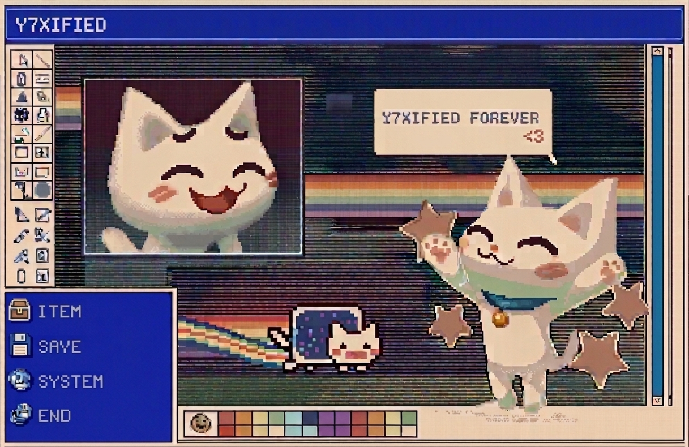

<div align="center">

```text
 █████╗ ██████╗ ██╗   ██╗██╗ ██████╗ ███╗   ██╗      ██████╗ ███████╗
██╔══██╗██╔══██╗██║   ██║██║██╔═══██╗████╗  ██║     ██╔═══██╗██╔════╝
███████║██████╔╝██║   ██║██║██║   ██║██╔██╗ ██║     ██║   ██║███████╗
██╔══██║██╔══██╗╚██╗ ██╔╝██║██║   ██║██║╚██╗██║     ██║   ██║╚════██║
██║  ██║██║  ██║ ╚████╔╝ ██║╚██████╔╝██║ ╚████║     ╚██████╔╝███████║
╚═╝  ╚═╝╚═╝  ╚═╝  ╚═══╝  ╚═╝ ╚═════╝ ╚═╝  ╚═══╝      ╚═════╝ ╚══════╝
```

**A futuristic browser-based desktop OS experience.**

[](https://react.dev/)
[](https://www.typescriptlang.org/)
[](https://vitejs.dev/)
[](https://tailwindcss.com/)
[](https://github.com/Y7X-bit/ARVION-OS)

</div>

---

## Overview

**ARVION-OS** is a browser-native desktop environment, built as an interactive OS simulation rather than a traditional static website.  
It includes windowed UI interactions, animated transitions, and immersive visual effects in a sci-fi design style.

---

## Features

- Windowed desktop-style interface
- Animated UI with Framer Motion and GSAP
- 3D visual capabilities with Three.js
- Component-driven React + TypeScript architecture
- Fast Vite dev/build workflow
- Responsive behavior across screen sizes

---

## Preview

<div align="center">
  <video src="./Arvion%20OS.mp4" controls autoplay muted loop playsinline preload="metadata" width="100%"></video>
</div>

---

## Tech Stack

| Category | Technology |
|---|---|
| Framework | React 18 + TypeScript |
| Build Tool | Vite 7 |
| Styling | Tailwind CSS 3 |
| Animation | Framer Motion, GSAP |
| 3D Graphics | Three.js |
| State | Zustand |
| Deployment | Vercel |

---

## Getting Started

### Prerequisites

- [Node.js](https://nodejs.org/) `v18+`
- [npm](https://www.npmjs.com/) `v9+`

### Installation

```bash
git clone https://github.com/Y7X-bit/ARVION-OS.git
cd ARVION-OS
npm install
npm run dev
```

App URL: `http://localhost:5173`

---

## Building for Production

```bash
npm run build
npm run preview
```

Output directory: `dist/`

---

## Deployment (Vercel)

1. Open [vercel.com/new](https://vercel.com/new)
2. Import `Y7X-bit/ARVION-OS`
3. Framework preset: `Vite`
4. Build command: `npm run build`
5. Output directory: `dist`
6. Deploy

---

## Project Structure

```text
ARVION-OS/
├── assets/
│   ├── footer.png
│   └── preview-card.svg
├── src/
│   ├── components/
│   ├── pages/
│   ├── App.tsx
│   ├── index.css
│   └── main.tsx
├── Arvion OS.mp4
├── index.html
├── package.json
├── postcss.config.js
├── tailwind.config.js
└── vite.config.ts
```

---

## Footer

```text
    ___    ____ _    _________  _   __   ____  _____
   /   |  / __ \ |  / /  _/ _ \/ | / /  / __ \/ ___/
  / /| | / /_/ / | / // // // /  |/ /  / / / /\__ \
 / ___ |/ _, _/| |/ // // // / /|  /  / /_/ /___/ /
/_/  |_/_/ |_| |___/___/\___/_/ |_/   \____//____/
```


