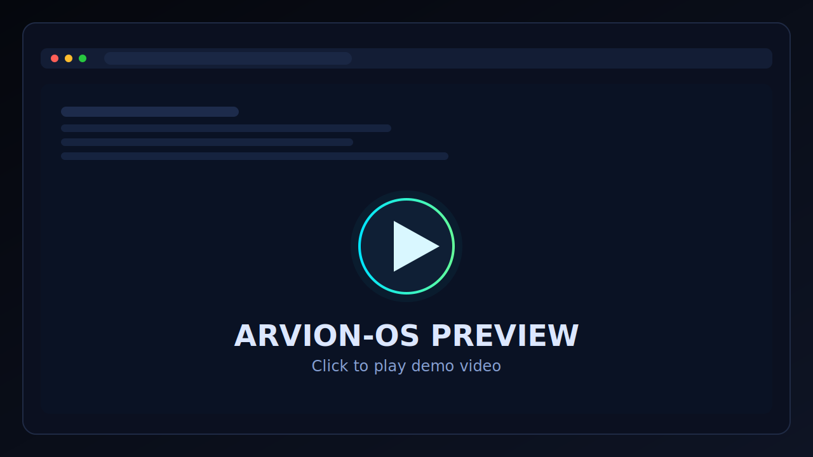

# ARVION-OS

ARVION-OS is a futuristic, desktop-style web experience built with React, TypeScript, Vite, and Tailwind CSS.

## Live Repository

[Y7X-bit/ARVION-OS](https://github.com/Y7X-bit/ARVION-OS)

## Preview

- Video preview: [Arvion OS.mp4](./Arvion%20OS.mp4)
- Click the preview window below to watch:

[](./Arvion%20OS.mp4)

## Tech Stack

- React 18
- TypeScript
- Vite
- Tailwind CSS
- Framer Motion + GSAP
- Three.js + Cannon-es + Matter.js
- Zustand

## Local Development

```bash
npm install
npm run dev
```

## Production Build

```bash
npm run build
npm run preview
```

## Deploy On Vercel

1. Import this repo in Vercel: [vercel.com/new](https://vercel.com/new)
2. Framework preset: `Vite`
3. Build command: `npm run build`
4. Output directory: `dist`
5. Deploy

---

## Footer

```text
    ___    ____ _    _________  _   __   ____  _____
   /   |  / __ \ |  / /  _/ _ \/ | / /  / __ \/ ___/
  / /| | / /_/ / | / // // // /  |/ /  / / / /\__ \
 / ___ |/ _, _/| |/ // // // / /|  /  / /_/ /___/ /
/_/  |_/_/ |_| |___/___/\___/_/ |_/   \____//____/
```


